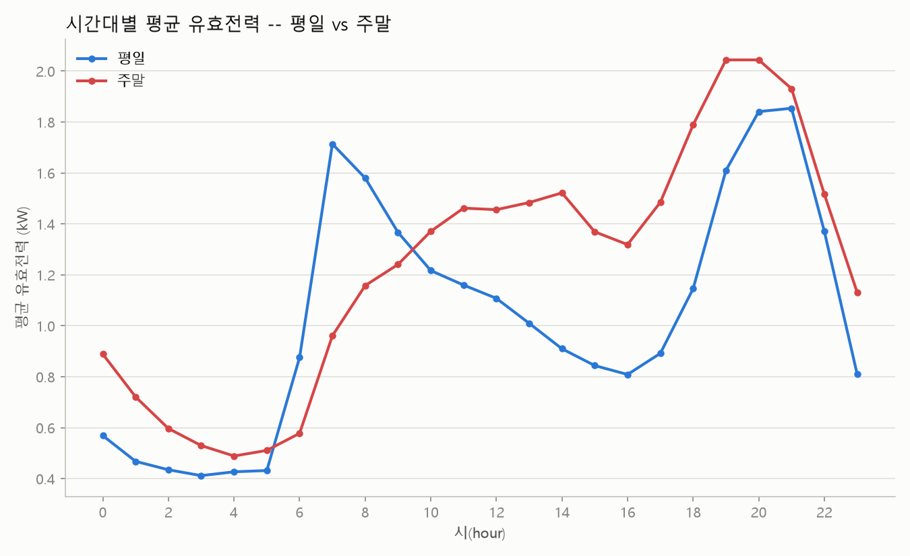
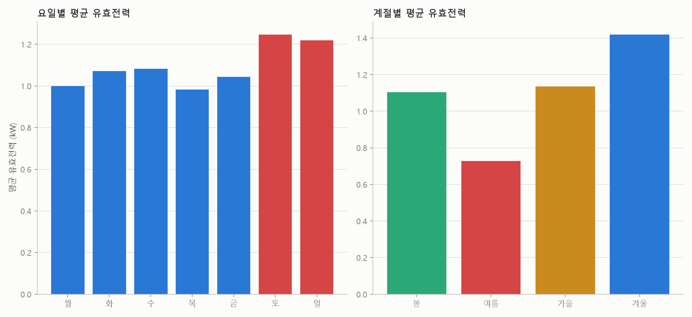
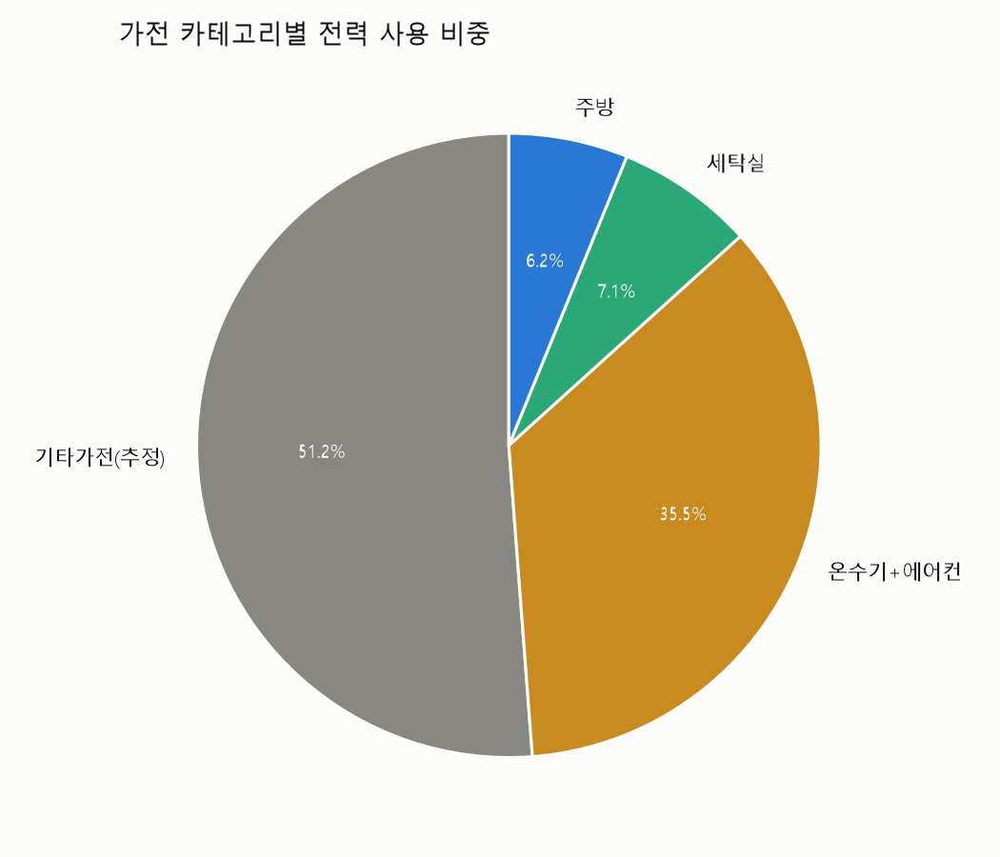
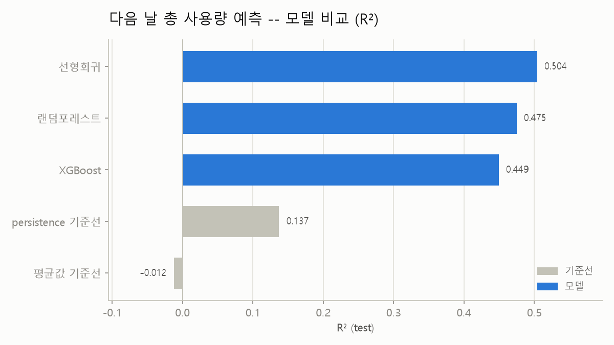

# 상세 분석 리포트: 가정용 전력 사용량 예측

> 정규 파이프라인(01~13) 완료. 프랑스 가정 1채의 4년치 분 단위 전력 데이터로, "다음 날
> 총 사용량을 예측할 수 있는가"를 풀었다. **결론: 선형회귀가 R²=0.5039로 최종 1위,
> 두 기준선(평균값·persistence)을 확실히 이겼다.**

## 목차

1. [무엇을 예측하는가](#1-무엇을-예측하는가)
2. [데이터 정리 과정에서 발견한 것](#2-데이터-정리-과정에서-발견한-것)
3. [EDA — 시간대·요일·계절 패턴](#3-eda--시간대요일계절-패턴)
4. [EDA — 가전 카테고리별 비중](#4-eda--가전-카테고리별-비중)
5. [기준선 (베이스라인)](#5-기준선-베이스라인)
6. [모델 비교](#6-모델-비교)
7. [변수중요도](#7-변수중요도)
8. [결론](#8-결론)
9. [남은 작업](#9-남은-작업)

부록. [진행 중 나온 질문·답변](#부록--진행-중-나온-질문답변-참고용) (참고용)

---

## 1. 무엇을 예측하는가

**타깃**: 다음 날 총 사용량(`next_day_energy_kWh`, kWh 단위 회귀).

처음엔 "다음 시간(next_hour_power)"으로 시작했으나, 진행 중 사용자와 논의 끝에
"다음 날"로 바꿨다(경위는 부록 Q&A 참고). 핵심 이유는 두 가지다.
- **관성 문제**: 전력 사용은 같은 활동이 몇 시간 이어지는 경향이 있어, 다음 시간 예측은
  persistence(오늘 값을 그대로 다음 시간 값으로 찍는) 기준선이 너무 강해질 위험이 있고
  실용성도 낮다.
- **데이터의 강점을 살리는 방향**: 이 데이터를 고른 이유가 애초에 "4년치라 계절성을
  온전히 학습할 수 있다"는 것이었는데, 다음 시간 예측은 이 강점을 거의 못 쓴다. 다음 날
  예측은 표본(1,411개)도 충분하고, 입력 변수에 월/요일을 넣으면 4번 반복된 계절 패턴을
  실제로 활용할 수 있다.

**입력 변수**: 오늘의 수치 7종(유효전력·무효전력·전압·전류·서브미터링 3종) + 내일 날짜의
월·요일(달력으로 미리 알 수 있어 누수 아님).

## 2. 데이터 정리 과정에서 발견한 것

- 원본은 분 단위 2,075,259행(2006-12-16~2010-11-26). 결측은 25,979행(1.25%)인데
  무작위가 아니라 **82일치가 통째로(하루 1,440분) 빠져 있었다**.
- 82일을 나눠보니 **완전결측 9일**(2010년 8월 18~21일 4일 연속, 9월 26~27일 2일 연속 등
  특정 시기에 몰림)과 **부분결측 73일**(1~12월 고르게 분포, 계절 쏠림 없음)로 갈렸다.
- 처리 방식(사용자와 논의 후 확정): 완전결측 9일은 제외, 부분결측은 시간별로 남아있는
  분 데이터만으로 평균(pandas `mean()`의 기본 결측 자동 제외)+3시간 이내 공백은
  보간. 리샘플 직후 제외한 날짜 바로 옆(2007-04-28, 2010-09-28 등)에 3시간 넘는 공백이
  추가로 발견돼 162시간을 더 드롭 — **최종 시간 단위 34,211행, 결측 0건.**
- 일 단위로 다시 뭉칠 때는(07단계) 하루 총량을 정확히 구해야 하므로 기준을 더 엄격하게
  잡았다 — **24시간이 다 채워지지 않은 날은 통째로 제외**(14일 추가 제외), 최종
  **1,419일**.
- 타깃(다음 날) 생성 시, 위 제외로 날짜가 매끄럽게 연속이 아니게 됐다는 점을 반영해
  "다음 행 날짜 == 오늘+1일"일 때만 타깃을 인정했다 — 공백 뒤 8개 지점 제외, 최종
  **1,411행**. 무작위 5개 지점에서 타깃==실제 다음 행 원본값 일치 확인(누수 없음).

## 3. EDA — 시간대·요일·계절 패턴

*(아래는 시간 단위 데이터 기준. 예측 모델은 일 단위를 쓰지만, "언제 많이 쓰는지"를
보려면 시간 단위가 필요해서 EDA는 시간 단위로 진행했다.)*

- **시간대**: 평일은 21시, 주말은 19~20시가 피크. 저녁 시간대(퇴근 후 활동)에 몰린다.
  주말이 평일보다 1.19배 더 쓴다.
- **계절**: 겨울이 여름의 1.95배 — 프랑스 가정이라 냉방보다 난방 비중이 커서, 우리나라와
  반대로 여름이 오히려 사용량이 가장 낮다.

## 4. EDA — 가전 카테고리별 비중

UCI 공식 산식(`Global_active_power*1000/60 - 서브미터링 3종 합`)으로 서브미터링이
못 잡는 "기타가전" 비중을 계산했다.

| 카테고리 | 비중 |
|---|---|
| 기타가전(조명·냉장고·대기전력 등, 추정) | 51.2% |
| 온수기+에어컨 | 35.5% |
| 세탁실 | 7.1% |
| 주방 | 6.2% |

기타가전이 절반을 넘고, 온수기+에어컨이 두 번째로 커서 3장의 "겨울에 많이 쓴다"는
결과와 맞물린다(난방 관련 기기로 추정). 음수(계측오차)는 0건으로 산식이 깔끔하게
들어맞았다.

## 5. 기준선 (베이스라인)

| 기준선 | RMSE | MAE | R² |
|---|---|---|---|
| 평균값 | 9.495 | 7.601 | -0.0123 |
| persistence(오늘=내일) | 8.766 | 6.424 | 0.1372 |

persistence가 평균값보다는 낫지만(R²=0.137), `korea-power-consumption-analysis`(0.99)나
`seoul-subway-demand-forecast`(0.64)만큼 압도적이진 않다 — 모델이 기여할 여지가
있다는 뜻이고, 실제로 6장에서 세 모델 다 이 기준선을 확실히 넘었다.

## 6. 모델 비교

무작위 8:2 분할(train 1,128 / test 283, random_state=42).

| 모델 | RMSE | MAE | R² |
|---|---|---|---|
| **선형회귀** | 6.647 | 5.059 | **0.5039** |
| 랜덤포레스트 | 6.840 | 5.080 | 0.4747 |
| XGBoost | 7.003 | 5.222 | 0.4493 |
| persistence 기준선 | 8.766 | 6.424 | 0.1372 |
| 평균값 기준선 | 9.495 | 7.601 | -0.0123 |

가장 단순한 **선형회귀가 1위**다. 랜덤포레스트(train R²=0.9339)와 XGBoost(train
R²=1.0000)는 둘 다 train/test 격차가 커서 과적합 징후가 있다 — 특히 XGBoost는 train을
완벽히 암기했다. **표본이 1,128행으로 적은데 트리 300개 기본값을 그대로 썼기 때문**으로
보인다(`seoul-rainfall-prediction`에서 겪은 것과 같은 패턴). 이 프로젝트는
`seoul-subway-demand-forecast`처럼 튜닝을 생략하는 lean 방향으로 진행했다 — 이미
선형회귀가 기준선을 크게 이겨서 결론이 분명했기 때문이다.

## 7. 변수중요도

랜덤포레스트: 오늘 유효전력(41.8%)이 압도적 1위, 그다음 무효전력·세탁실·전압·전류
순으로 고르게 분산.

XGBoost: 흥미롭게도 **weekday_tomorrow(토요일)·month_tomorrow(8월·7월·12월)가
상위권**을 차지했다 — 오늘 값 하나보다 "내일이 언제인지"가 더 중요하게 쓰였다는 뜻이다.
이는 "타깃은 그대로 두고 입력에 월/계절을 넣어 4년치 계절성을 활용하자"던 판단이
실제로 유효했음을 보여주는 근거다.

## 8. 결론

- **다음 날 총 사용량은 예측 가능하다.** 선형회귀 R²=0.5039로 persistence(0.137)를
  뚜렷하게 이겼다.
- 가장 단순한 모델이 가장 잘 맞았다 — 표본(1,411행, train 1,128행)이 트리 기반 모델의
  복잡도를 감당하기엔 작았기 때문으로 보인다.
- 타깃 단위를 "다음 시간"에서 "다음 날"로 바꾼 판단은 결과로도 뒷받침됐다 — XGBoost
  변수중요도에서 월/요일이 상위권을 차지해, 4년치 데이터의 계절성이 실제로 예측에
  기여했다.
- 이 프로젝트로 4개 포트폴리오 프로젝트가 "시간 해상도(일→월→시간→분 집계)·범위
  (지점 1개→역 5개→전국 17개 시도→가정 1채)·문제 유형(예측/EDA)"을 골고루 다루게
  됐다.

## 9. 남은 작업

- [ ] 시간 누수 검증(무작위 분할 vs 날짜순 분할 비교)은 하지 않았다 — `seoul-subway-demand-forecast`
      와 같은 이유(lean 진행, 이미 결론이 분명함)로 생략. 08단계에서 "다음 행=+1일"
      검증으로 최소한의 인접성은 확인했다.
- [ ] 이상치 탐지·잔차 분석(pipe-line.md 14~15단계)은 진행하지 않았다.
- [ ] GitHub 공개 저장소로 뺄지, 언제 뺄지는 사용자 판단 대기 중.
- [ ] 데이터 출처 URL은 README/LICENSE에 이미 반영 완료.

---

## 부록 — 진행 중 나온 질문·답변 (참고용)

> 사용자가 진행 중에 물어본 개념 질문과 답을 나중에 다시 찾아보기 쉽도록 여기 모아둔다.
> 본문(위 1~9번)이 다 채워진 뒤에도 이 부록은 계속 이어서 추가한다.

### Q. 시간 단위 집계에서 "부분결측 시간은 남은 데이터로 평균 낸다"고 할 때, "남은 데이터"가 뭔가?

**A.** 결측이 아닌, 그 시간(1시간=60분) 안에 실제 값이 남아있는 분(分) 단위 데이터를
말한다. 예를 들어 14시~15시 구간의 60개 분 값 중 20분치가 결측(`?`)이면, 그 20분은
빼고 **나머지 40분 값만으로** 평균을 내서 "14시 대표값"으로 쓴다. pandas의 `mean()`이
기본적으로 결측치를 자동으로 건너뛰기 때문에 별도 코드 없이 이렇게 동작한다. 다만 60분
전부가 결측이면(=남은 데이터가 0개) 평균 낼 값 자체가 없어 그 시간은 빈 칸(NaN)으로
남는데, `02_aggregate_hourly.py`에서 이런 경우가 162개 시간 있었고 보간 한도(3시간)를
넘어 결국 드롭했다.

### Q. "다음 시간의 유효전력"이란 게 "9시 이전 데이터로 9시 사용량 예측"이라는 뜻인가? 이게 의미가 있나?

**A.** 정확히는 "9시 이전 → 9시"가 아니라 **"9시(까지)의 데이터로 10시(다음 시간)를
예측"**하는 거였다. 다만 의미 문제 제기는 타당했다 — 전력 사용은 관성이 강해서(세탁기가
몇 시간 이어지는 식) persistence(그냥 지금 값을 다음 시간 값으로 찍는) 기준선이 이미
강력할 가능성이 높고, 1시간 뒤 예측은 실용성도 낮다.

### Q. 이 데이터는 몇 년치인가? 과거 8월들로 올해 8월을 예측하는 것도 의미 있지 않나?

**A.** 2006-12-16~2010-11-26, 약 3년 11개월(47개월)치다. "8월"은 이 기간에 2007~2010년
**딱 4번**만 나온다. 그래서 "연도별 같은 달 예측"을 한 해 단위 값 하나로 잡으면, 학습에
쓸 짝(과거 8월들→다음 8월)이 3개뿐이라 ML 모델을 학습·검증하기엔 표본이 너무 적다.
대신 **타깃은 그대로 두고 입력 변수에 월/계절을 추가**하면, 4번의 여름·겨울 전체 날짜가
다 학습 재료가 되어 표본 부족 없이 같은 효과(계절성 학습)를 얻을 수 있다.

**최종 결정(2026-08-22)**: 타깃을 "다음 시간"에서 "다음 날 총 사용량"으로 바꿨다.
`07_build_next_hour_target.py`(다음 시간 버전)는 폐기하고, `07_aggregate_daily.py`
(일 단위 재집계) → `08_build_next_day_target.py`(다음 날 타깃)로 다시 만들었다. 입력
변수에는 월/계절을 반드시 포함시켜 4년치 계절성을 살릴 계획이다.

### Q. 시간 단위와 일 단위 중 이 프로젝트 의도에는 뭐가 더 맞나?

**A.** 일(daily)이 더 맞다. 이 데이터를 고른 원래 이유가 "4년치라 계절성을 온전히
학습할 수 있다"(`korea-power-consumption-analysis`의 12개월 한계를 극복)는 것이었는데,
"다음 시간" 예측은 관성이 지배적이라 몇 주치 데이터만 있어도 풀리는 문제라 4년치의
강점을 거의 못 쓴다. 반면 "다음 날" 예측은 표본이 1,411개로 충분하고, 계절/요일 같은
변수가 하루 단위 값에 뚜렷하게 반영돼 4년치 계절 반복을 실제로 활용한다. 시간 단위
EDA(04~06)는 폐기되지 않고 "언제·무엇을 쓰는지" 설명하는 역할로 남는다 — 예측(일 단위)과
설명(시간 단위)의 역할을 나눈 것.
